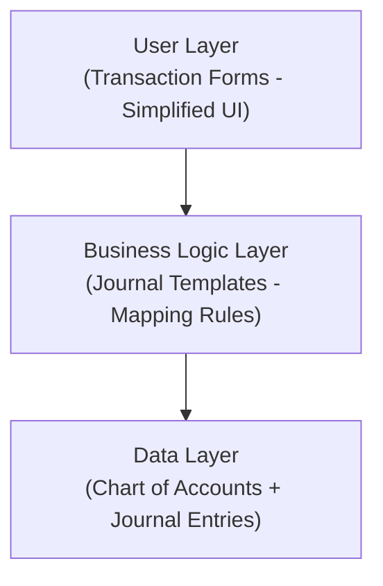
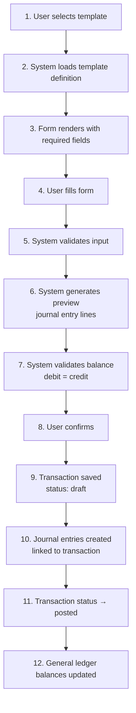

# System Architecture

## Core Design Principle: Transaction-Centric

### Traditional Account-Centric Approach (What We're NOT Doing)

In traditional accounting software, users must understand debits/credits:

**Example: Paying electricity bill Rp 1,000,000**
```
User must know:
Debit:  Beban Listrik (Electricity Expense)     Rp 1,000,000
Credit: Kas/Bank (Cash/Bank)                    Rp 1,000,000
```

**Problems:**
- Requires understanding which accounts to debit/credit
- Must remember debit = expense increase, credit = cash decrease
- Easy to get backwards
- Intimidating for beginners

### Our Transaction-Centric Approach

Users describe business events; system handles accounting.

**Same example: Paying electricity bill**

User fills simple form:
```
Transaction Type: Expense Payment
Date: 2025-01-15
Description: Electricity bill
Category: Utilities - Electricity
Amount: Rp 1,000,000
Paid from: BCA Checking Account
```

System automatically generates proper journal entries:
```
Debit:  Beban Listrik        Rp 1,000,000
Credit: Bank BCA             Rp 1,000,000
```

### More Examples

**Receive customer payment:**
- Form: "Receive Payment"
- Fields: Customer name, Invoice #, Amount, Bank account
- User never sees "Debit Bank, Credit Piutang"

**Purchase inventory:**
- Form: "Purchase"
- Fields: Supplier, Items, Quantity, Price, Payment method
- System handles: Debit Inventory, Credit Bank (or Hutang if unpaid)

**Owner withdrawal:**
- Form: "Owner Withdrawal"
- Fields: Amount, Date, Bank account
- System: Debit Prive/Modal, Credit Bank

## Three-Layer Architecture



### Layer 1: User Layer (Transaction Forms)

**Purpose:** Present business-friendly interfaces

**Characteristics:**
- Simple forms for common business scenarios
- No accounting jargon
- Validation and guidance
- Preview of what will be recorded

**Example Forms:**
- Terima Pembayaran dari Customer
- Bayar Supplier
- Bayar Gaji Karyawan
- Bayar Beban Operasional
- Catat Penjualan
- Tarik Tunai untuk Pribadi

### Layer 2: Business Logic Layer (Journal Templates)

**Purpose:** Translate business transactions into accounting entries

**Key Features:**
- Pre-configured templates for common scenarios
- User-customizable templates for power users
- Mapping rules: transaction fields → accounting accounts
- Amount calculation logic (percentages, formulas)
- Support for simple to complex entries

**Template Types:**

1. **System Templates** (preloaded, available to all tenants)
   - Common business transactions
   - Indonesian tax scenarios
   - Industry-specific templates

2. **Custom Templates** (created by power users)
   - Business-specific workflows
   - Complex multi-line entries
   - Exotic accounting scenarios

**Template Capabilities:**
- Fixed accounts (e.g., PPN Masukan always goes to account 1-1400)
- User-selectable accounts (e.g., which expense category)
- Calculated amounts (e.g., PPN = 11% of base amount)
- Multiple debit/credit lines (one-to-many, many-to-one, many-to-many)

### Layer 3: Data Layer (Chart of Accounts)

**Purpose:** Maintain proper double-entry bookkeeping

**Characteristics:**
- Standard chart of accounts structure
- Industry-specific templates
- Hierarchical account organization
- Full audit trail
- Immutable journal entries (soft delete only)

## Journal Template System

### How Templates Work

**Template Definition:**
```
Template: "Bayar Beban + PPN Masukan"

Lines:
1. Debit  | User selects account    | 100% of transaction amount  | Label: "Akun Beban"
2. Debit  | Fixed: PPN Masukan      | 11% of transaction amount   | Auto
3. Credit | User selects account    | 111% of transaction amount  | Label: "Dibayar dari"
```

**User Experience:**
```
Form displays:
- Jumlah (DPP): Rp 1,000,000
- Kategori Beban: [dropdown - user selects]
- Dibayar dari: [dropdown - user selects]

Preview shows:
Debit:  Beban Sewa Kantor    Rp 1,000,000
Debit:  PPN Masukan          Rp   110,000
Credit: Bank BCA             Rp 1,110,000
                             ============
Total:                       Rp         0  ✓ Balanced
```

**Posted Journal Entries:**
```
Date: 2025-01-15
Reference: TRX-00123

Account              Debit         Credit
5-2100 Beban Sewa    1,000,000     -
1-1400 PPN Masukan     110,000     -
1-1200 Bank BCA        -           1,110,000
                     ===========   ===========
                     1,110,000     1,110,000  ✓
```

### Template Examples

#### Simple Template: Cash Sale
```
Lines:
1. Debit  | User: "Bank Account"        | 100%
2. Credit | User: "Revenue Account"     | 100%
```

#### Medium Complexity: Expense with Tax
```
Lines:
1. Debit  | User: "Expense Account"     | 100%
2. Debit  | Fixed: "PPN Masukan"        | 11%
3. Credit | User: "Payment Account"     | 111%
```

#### Complex: Payment with Discount
```
Lines:
1. Debit  | Fixed: "Hutang Usaha"       | invoice_amount
2. Credit | User: "Bank Account"        | payment_amount
3. Credit | User: "Discount Account"    | discount_amount
```

#### Power User: Multi-Split Allocation
```
Lines:
1. Debit  | User: "Cabang A Expense"    | user_defined
2. Debit  | User: "Cabang B Expense"    | user_defined
3. Debit  | User: "Cabang C Expense"    | user_defined
4. Credit | User: "Payment Account"     | sum_of_debits
```

## User Personas & Capabilities

### Common User (Business Owner / Junior Bookkeeper)
**Capabilities:**
- Select from pre-configured templates
- Fill simple forms
- No need to understand debits/credits
- Can preview journal entries before posting

**Workflow:**
1. New Transaction → Select Template
2. Fill form fields
3. Review preview (optional)
4. Post

### Power User (Accountant / Senior Bookkeeper)
**Capabilities:**
- All common user capabilities
- Create custom journal templates
- Manual journal entry (direct debit/credit)
- Edit chart of accounts
- View/edit underlying journal entries

**Workflow:**
1. Access "Journal Templates" menu
2. Create/edit templates:
   - Define debit/credit lines
   - Set fixed vs user-selectable accounts
   - Configure amount calculations
3. Use custom templates in transactions
4. Or bypass templates with manual journal entry

## Multi-Tenancy Architecture

### Design Principles
- Single database, tenant isolation via `tenant_id`
- Data segregation enforced at application layer
- Shared system templates, isolated custom templates
- Per-tenant chart of accounts (can start from templates)

### Tenant Isolation Strategy
```
Every table (except system tables) has:
- tenant_id (not null)
- Row-level security enforced in queries
- Indexed for performance

System tables (no tenant_id):
- journal_templates (where is_system = true)
- system_settings
- currency_definitions

Tenant tables:
- chart_of_accounts
- transactions
- journal_entries
- journal_templates (where is_system = false)
- customers
- vendors
```

### User Roles
1. **Owner** (business owner)
   - Full access to their company data
   - Cannot create templates
   - Read-only view of journal entries

2. **Operator** (bookkeeper)
   - Can manage multiple tenants
   - Create/edit transactions
   - Cannot modify chart of accounts
   - Cannot create templates

3. **Power Operator** (senior bookkeeper / accountant)
   - All operator capabilities
   - Create custom templates
   - Edit chart of accounts
   - Manual journal entries

4. **Viewer** (external accountant)
   - Read-only access
   - Export reports
   - No data entry

5. **Auditor** (external auditor)
   - Read-only access to all financial data
   - View all transactions and supporting documents
   - Access to complete audit trail
   - Export capabilities for audit work papers
   - Time-bound access (temporary, can be revoked)
   - No ability to modify any data
   - View document access logs

## Data Flow

### Transaction Entry → Journal Posting



### Template Resolution Logic

```python
def generate_journal_entries(transaction, template):
    entries = []

    for line in template.lines:
        entry = {}

        # Resolve account
        if line.account_id:
            # Fixed account in template
            entry.account = line.account_id
        else:
            # User-selected account from transaction
            entry.account = transaction.mappings[line.mapping_key]

        # Calculate amount
        if line.amount_source == 'transaction_amount':
            entry.amount = transaction.amount * line.amount_value / 100
        elif line.amount_source == 'fixed':
            entry.amount = line.amount_value
        elif line.amount_source == 'formula':
            entry.amount = eval_formula(line.formula, transaction)

        # Set debit/credit
        entry.debit = entry.amount if line.line_type == 'debit' else 0
        entry.credit = entry.amount if line.line_type == 'credit' else 0

        entries.append(entry)

    # Validate balance
    assert sum(e.debit for e in entries) == sum(e.credit for e in entries)

    return entries
```

## Scalability Considerations

### Performance
- Index on `tenant_id` for all queries
- Materialized views for complex reports
- Async report generation for heavy reports
- Pagination for transaction lists

### Storage
- Soft deletes for audit trail
- Archival strategy for old fiscal years
- Document storage (receipts) external (S3/GCS)

### Reporting
- Pre-aggregated summary tables
- Background job for report generation
- Cache frequently accessed reports
- Export limits for large datasets

## Security Principles

### Data Protection
- Tenant data isolation (no cross-tenant queries)
- Audit log for all data modifications
- Immutable journal entries (append-only)
- Role-based access control (RBAC)

### Compliance
- Audit trail for tax purposes
- Data retention policies
- Backup and disaster recovery
- Export capabilities for tax audits
